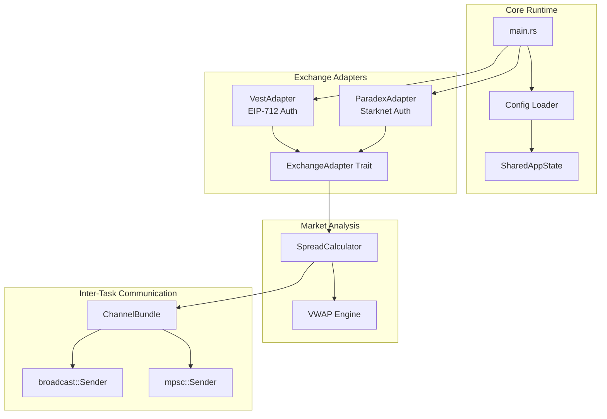

# HFT Arbitrage Bot - Architecture Documentation

> **Auto-generated by document-project workflow**  
> **Scan Level:** Exhaustive | **Project Type:** backend

---

## Executive Summary

Delta-neutral HFT arbitrage bot for perpetual futures markets. Monitors spread between two DEXes (Vest and Paradex) and executes simultaneous long/short positions when spread exceeds configurable thresholds.



---

## Module Structure

```
src/
├── main.rs                 # Entry point (scaffold)
├── lib.rs                  # Module exports
├── error.rs                # AppError enum with thiserror
├── adapters/
│   ├── mod.rs              # Re-exports
│   ├── traits.rs           # ExchangeAdapter trait + MockAdapter
│   ├── types.rs            # Orderbook, OrderRequest, ConnectionHealth
│   ├── errors.rs           # ExchangeError variants
│   ├── vest.rs             # Vest Markets adapter (EIP-712)
│   └── paradex.rs          # Paradex adapter (Starknet)
├── core/
│   ├── mod.rs              # Re-exports
│   ├── spread.rs           # SpreadCalculator, SpreadResult, SpreadTick
│   ├── vwap.rs             # VWAP calculation with slippage
│   ├── state.rs            # SharedAppState, BotState, Metrics
│   ├── channels.rs         # ChannelBundle for inter-task comm
│   └── logging.rs          # Structured logging, SanitizedValue
└── config/
    ├── mod.rs              # Re-exports
    ├── types.rs            # AppConfig, BotConfig, RiskConfig
    ├── loader.rs           # YAML loading & validation
    ├── constants.rs        # Env-configurable defaults
    └── supabase.rs         # Supabase config
```

---

## Key Components

### 1. Exchange Adapters

| Adapter | Auth Method | Transport | Lines |
|---------|-------------|-----------|-------|
| **VestAdapter** | EIP-712 (ethers) | WebSocket + REST | 2140 |
| **ParadexAdapter** | Starknet SNIP-12 | WebSocket + REST | 2868 |

Both implement `ExchangeAdapter` trait:
```rust
#[async_trait]
pub trait ExchangeAdapter: Send + Sync {
    async fn connect(&mut self) -> ExchangeResult<()>;
    async fn disconnect(&mut self) -> ExchangeResult<()>;
    async fn subscribe_orderbook(&mut self, symbol: &str) -> ExchangeResult<()>;
    async fn unsubscribe_orderbook(&mut self, symbol: &str) -> ExchangeResult<()>;
    async fn place_order(&mut self, order: OrderRequest) -> ExchangeResult<OrderResponse>;
    async fn cancel_order(&mut self, order_id: &str) -> ExchangeResult<()>;
    async fn get_positions(&self) -> ExchangeResult<Vec<PositionInfo>>;
    fn get_orderbook(&self, symbol: &str) -> Option<Orderbook>;
    fn is_connected(&self) -> bool;
    fn connection_health(&self) -> &ConnectionHealth;
    fn exchange_name(&self) -> &'static str;
}
```

### 2. Spread Calculator

**Performance Target:** <2ms per calculation (NFR2 compliant)

| Function | Purpose | Formula |
|----------|---------|---------|
| `calculate()` | Best spread opportunity | Returns better of A→B or B→A |
| `calculate_entry_spread()` | Entry monitor | `(ASK_A - BID_B) / midpoint × 100` |
| `calculate_exit_spread()` | Exit monitor | `(BID_A - ASK_B) / midpoint × 100` |
| `calculate_dual_spreads()` | Dashboard use | Returns `(entry, exit)` tuple |

### 3. VWAP Engine

Calculates realistic execution prices across orderbook depth:
```rust
pub struct VwapResult {
    pub vwap_price: f64,       // Volume-weighted average
    pub total_quantity: f64,   // Filled amount
    pub slippage_bps: f64,     // Basis points from best
    pub levels_consumed: usize,
    pub best_price: f64,
}
```

### 4. Configuration System

**YAML-driven** with validation:
```yaml
bots:
  - id: btc_vest_paradex
    pair: BTC-PERP
    dex_a: vest
    dex_b: paradex
    spread_entry: 0.30    # Entry threshold %
    spread_exit: 0.05     # Exit threshold %
    leverage: 10
    capital: 100.0

risk:
  adl_warning: 10.0
  adl_critical: 5.0
  max_duration_hours: 24

api:
  port: 8080
  ws_heartbeat_sec: 30
```

**Validation Rules:**
- `spread_entry > spread_exit`
- `dex_a ≠ dex_b`
- `leverage ∈ [1, 100]`
- `capital > 0`

---

## Inter-Task Communication

```rust
pub struct ChannelBundle {
    // Scout → Main: spread opportunities
    pub opportunity_tx: mpsc::Sender<SpreadOpportunity>,
    pub opportunity_rx: mpsc::Receiver<SpreadOpportunity>,
    
    // Main → All: shutdown broadcast
    pub shutdown_tx: broadcast::Sender<()>,
}
```

---

## Technology Stack

| Category | Technology | Purpose |
|----------|------------|---------|
| **Runtime** | Tokio | Async runtime |
| **HTTP** | reqwest | REST API calls |
| **WebSocket** | tokio-tungstenite | Market data streaming |
| **Crypto (EVM)** | ethers | EIP-712 signatures for Vest |
| **Crypto (Stark)** | starknet-crypto | SNIP-12 signatures for Paradex |
| **Serialization** | serde, serde_yaml, serde_json | Config & messages |
| **Logging** | tracing, tracing-subscriber | Structured logs |
| **Error Handling** | thiserror, anyhow | Error types |

---

## Performance Requirements

| Metric | Target | Implementation |
|--------|--------|----------------|
| Spread calc latency | <2ms | `#[inline]`, no allocations |
| 10k spread calcs | <2ms total | Verified in tests |
| 10k VWAP calcs | <2ms total | Verified in tests |
| WebSocket ping timeout | 5s | `PING_TIMEOUT_SECS` |
| Order timeout | 10s | HTTP client config |

---

## Security Patterns

### Sensitive Data Handling
```rust
pub struct SanitizedValue<'a>(&'a str);

impl fmt::Display for SanitizedValue<'_> {
    fn fmt(&self, f: &mut fmt::Formatter<'_>) -> fmt::Result {
        if self.0.len() > 8 {
            write!(f, "{}...REDACTED", &self.0[..4])
        } else {
            write!(f, "REDACTED")
        }
    }
}
```

**Protected Fields:** `api_key`, `private_key`, `secret`, `signature`, `password`, `token`

---

## Error Hierarchy

```
AppError
├── Config(String)
├── Exchange(ExchangeError)
├── WebSocket(tokio_tungstenite::Error)
└── Io(std::io::Error)

ExchangeError
├── ConnectionFailed(String)
├── AuthenticationFailed(String)
├── SubscriptionFailed { symbol, reason }
├── OrderRejected(String)
├── OrderTimeout(String)
├── InvalidResponse(String)
├── RateLimited { retry_after_ms }
└── NotConnected
```
