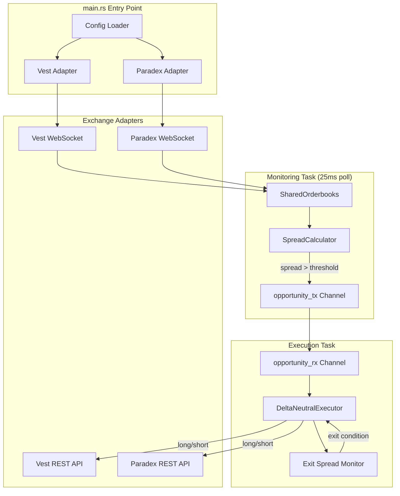

# HFT Arbitrage Bot - Architecture V1

> **Version:** 1.0.0 (Radical Purity V1)  
> **Updated:** 2026-02-04  
> **Type:** Rust Backend (Tokio Async)

---

## Executive Summary

Delta-neutral HFT arbitrage bot for perpetual futures trading across two DEXes (Vest and Paradex). The V1 architecture prioritizes **minimum latency** with a lock-free design:

- **No persistence** (Supabase removed)
- **No Mutex locks** (SharedOrderbooks via `Arc<RwLock>`)
- **40Hz polling** (25ms intervals)
- **Parallel order execution** via `tokio::join!`

---

## System Architecture



---

## Technology Stack

| Category | Technology | Version | Purpose |
|----------|------------|---------|---------|
| Language | Rust | 2021 edition | Systems language |
| Runtime | Tokio | 1.x | Async runtime |
| WebSocket | tokio-tungstenite | 0.24 | Real-time feeds |
| HTTP | reqwest | 0.11 | REST API calls |
| Serialization | serde/serde_json | 1.x | JSON parsing |
| Config | serde_yaml | 0.9 | YAML config |
| Crypto (Vest) | ethers + alloy | 2.0/0.8 | EIP-712 signing |
| Crypto (Paradex) | starknet-crypto/signers | 0.6/0.14 | SNIP-12 signing |
| Logging | tracing | 0.1 | Structured logging |
| Error Handling | thiserror + anyhow | 1.x | Typed errors |
| UUID | uuid | 1.x | Client order IDs |

---

## Module Structure

```
src/
├── main.rs              # Entry point (242 lines)
├── lib.rs               # Module exports
├── error.rs             # AppError enum
│
├── adapters/            # Exchange connectivity (~230KB total)
│   ├── mod.rs           # Module exports
│   ├── traits.rs        # ExchangeAdapter trait (343 lines)
│   ├── types.rs         # Orderbook, Order types (617 lines)
│   ├── errors.rs        # ExchangeError variants
│   ├── vest/            # Vest Markets adapter (~88KB)
│   │   ├── adapter.rs   # Main adapter (56KB)
│   │   ├── signing.rs   # EIP-712 auth (15KB)
│   │   ├── config.rs    # VestConfig (5KB)
│   │   └── types.rs     # Vest-specific types (11KB)
│   └── paradex/         # Paradex adapter (~106KB)
│       ├── adapter.rs   # Main adapter (65KB)
│       ├── signing.rs   # SNIP-12 auth (23KB)
│       ├── config.rs    # ParadexConfig (5KB)
│       └── types.rs     # Paradex types (12KB)
│
├── core/                # Business logic (~97KB total)
│   ├── mod.rs           # Module exports
│   ├── execution.rs     # DeltaNeutralExecutor (894 lines)
│   ├── spread.rs        # SpreadCalculator (593 lines)
│   ├── runtime.rs       # execution_task (398 lines)
│   ├── monitoring.rs    # monitoring_task (308 lines)
│   └── channels.rs      # SpreadOpportunity (5KB)
│
├── config/              # Configuration (~22KB)
│   ├── mod.rs           # Exports
│   ├── types.rs         # BotConfig, AppConfig (499 lines)
│   ├── loader.rs        # YAML loading (6KB)
│   └── constants.rs     # Defaults
│
├── bin/                 # Utility binaries
│   ├── monitor.rs       # Orderbook monitor
│   └── test_paradex_order.rs
│
└── tests/               # Integration tests
    └── full_cycle.rs
```

---

## Core Components

### 1. ExchangeAdapter Trait

Unified interface for all exchange adapters:

```rust
#[async_trait]
pub trait ExchangeAdapter {
    async fn connect(&mut self) -> ExchangeResult<()>;
    async fn disconnect(&mut self) -> ExchangeResult<()>;
    async fn subscribe_orderbook(&mut self, symbol: &str) -> ExchangeResult<()>;
    async fn place_order(&self, order: OrderRequest) -> ExchangeResult<OrderResponse>;
    async fn cancel_order(&self, order_id: &str) -> ExchangeResult<()>;
    fn get_orderbook(&self, symbol: &str) -> Option<&Orderbook>;
    fn is_connected(&self) -> bool;
    fn is_stale(&self) -> bool;
    async fn reconnect(&mut self) -> ExchangeResult<()>;
    async fn get_position(&self, symbol: &str) -> ExchangeResult<Option<PositionInfo>>;
    fn exchange_name(&self) -> &'static str;
}
```

### 2. SpreadCalculator

Calculates entry/exit spreads between two orderbooks:

- **Entry Spread:** `(BID_B - ASK_A) / ASK_A × 100`
- **Exit Spread:** `(BID_A - ASK_B) / ASK_B × 100`
- Target latency: <2ms per calculation

### 3. DeltaNeutralExecutor

Executes simultaneous long/short orders using `tokio::join!`:

- Long on one exchange, short on the other
- Uses IOC limit orders for minimum slippage
- Tracks position state and entry direction
- Supports reduce_only for position closing

### 4. Monitoring Task (V1 HFT)

Lock-free orderbook monitoring:

- 25ms polling interval (40Hz)
- Reads from `SharedOrderbooks` (`Arc<RwLock<HashMap>>`)
- 1Hz log decimation to reduce noise
- Emits `SpreadOpportunity` when threshold exceeded

### 5. Execution Task (V1 HFT)

Consumes spread opportunities and manages position lifecycle:

- Entry: Execute delta-neutral trade when spread > entry_threshold
- Hold: Monitor for exit condition
- Exit: Close position when spread converges to exit_threshold

---

## Data Flow

```
1. WebSocket feeds update SharedOrderbooks (per adapter)
      ↓
2. monitoring_task polls SharedOrderbooks every 25ms
      ↓
3. SpreadCalculator computes entry/exit spreads
      ↓
4. If spread > threshold → SpreadOpportunity sent via mpsc channel
      ↓
5. execution_task receives opportunity
      ↓
6. DeltaNeutralExecutor places parallel long/short orders
      ↓
7. Execution task monitors for exit condition
      ↓
8. When exit threshold met → close_position()
```

---

## Key Design Patterns

### Lock-Free Architecture (V1)
- `SharedOrderbooks = Arc<RwLock<HashMap<String, Orderbook>>>`
- Monitoring reads, WebSocket handler writes
- No Mutex contention in the hot path

### Parallel Order Execution
```rust
let (vest_result, paradex_result) = tokio::join!(
    self.vest_adapter.place_order(vest_order),
    self.paradex_adapter.place_order(paradex_order)
);
```

### Graceful Shutdown
- `broadcast::channel<()>` for shutdown signals
- Ctrl+C handler broadcasts to all tasks
- Tasks check `shutdown_rx` in select! loops

---

## Configuration

### config.yaml Structure
```yaml
bots:
  - id: "btc-arb-1"
    pair: BTC-PERP
    dex_a: vest
    dex_b: paradex
    spread_entry: 0.15    # Entry threshold %
    spread_exit: 0.05     # Exit threshold %
    leverage: 10
    position_size: 0.01   # BTC
```

### Environment Variables
```bash
# Vest (EIP-712)
VEST_PRIMARY_ADDR=0x...
VEST_PRIMARY_KEY=0x...
VEST_SIGNING_KEY=0x...

# Paradex (Starknet)
PARADEX_PRIVATE_KEY=0x...
PARADEX_ACCOUNT_ADDRESS=0x...
```

---

## Performance Targets

| Metric | Target | V1 Achievement |
|--------|--------|----------------|
| Spread calc latency | <2ms | <200ns |
| Order placement | <200ms | ~150ms (REST) |
| Monitoring poll rate | 25ms | ✓ 40Hz |
| WS orderbook updates | Real-time | ✓ |

---

## Related Documentation

- [Data Models](data-models.md) - All structs and enums
- [API Contracts](api-contracts.md) - Trait interfaces, REST/WS protocols
- [Source Tree](source-tree.md) - Complete file listing
