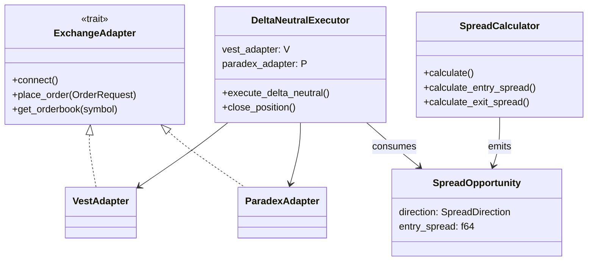

# HFT Arbitrage Bot - Data Models

> **Updated:** 2026-02-04  
> **Source:** Exhaustive scan of all Rust structs and enums

---

## Core Types (`adapters/types.rs`)

### Orderbook Types

```rust
/// Single orderbook level (price + quantity)
pub struct OrderbookLevel {
    pub price: f64,
    pub quantity: f64,
}

/// Orderbook snapshot with bid/ask levels
pub struct Orderbook {
    pub bids: Vec<OrderbookLevel>,  // Sorted high→low
    pub asks: Vec<OrderbookLevel>,  // Sorted low→high
    pub timestamp: u64,
    pub symbol: String,
}
```

### Order Types

```rust
pub enum OrderSide { Buy, Sell }

pub enum OrderType { Limit, Market }

pub enum TimeInForce { Ioc, Gtc, Fok }

pub enum OrderStatus {
    Pending,
    Open,
    Filled,
    PartiallyFilled,
    Cancelled,
    Rejected,
    Expired,
}

/// Order request to exchange
pub struct OrderRequest {
    pub client_order_id: String,
    pub symbol: String,
    pub side: OrderSide,
    pub order_type: OrderType,
    pub price: Option<f64>,          // Required for Limit
    pub quantity: f64,
    pub time_in_force: TimeInForce,
    pub reduce_only: bool,           // Close-only flag
    pub post_only: bool,             // Maker-only flag
}

/// Order response from exchange
pub struct OrderResponse {
    pub order_id: String,
    pub client_order_id: String,
    pub status: OrderStatus,
    pub filled_quantity: f64,
    pub avg_fill_price: f64,
    pub exchange: String,
}
```

### Connection Health

```rust
pub enum ConnectionState {
    Connected,
    Disconnected,
    Reconnecting,
}

/// Shared health state for WebSocket monitoring
pub struct ConnectionHealth {
    pub state: Arc<Mutex<ConnectionState>>,
    pub last_pong: Arc<Mutex<Instant>>,
    pub pong_received: Arc<AtomicBool>,
}
```

### Position Info

```rust
pub struct PositionInfo {
    pub symbol: String,
    pub side: OrderSide,
    pub size: f64,
    pub entry_price: f64,
    pub unrealized_pnl: f64,
    pub leverage: f64,
}
```

---

## Execution Types (`core/execution.rs`)

```rust
/// Status of a single leg in delta-neutral trade
pub enum LegStatus {
    Success(OrderResponse),
    Failed(String),
}

/// Result of delta-neutral execution
pub struct DeltaNeutralResult {
    pub vest_leg: LegStatus,
    pub paradex_leg: LegStatus,
    pub entry_spread: f64,
    pub timestamp: u64,
}

/// Executor for delta-neutral trades
pub struct DeltaNeutralExecutor<V, P> {
    vest_adapter: V,
    paradex_adapter: P,
    default_quantity: f64,
    vest_symbol: String,
    paradex_symbol: String,
    position_open: AtomicBool,
    entry_direction: Mutex<Option<SpreadDirection>>,
}
```

---

## Spread Types (`core/spread.rs`)

```rust
/// Direction of spread opportunity
pub enum SpreadDirection {
    AOverB,  // ASK_A > BID_B (buy on A, sell on B)
    BOverA,  // ASK_B > BID_A (buy on B, sell on A)
}

/// Spread calculation result
pub struct SpreadResult {
    pub spread_pct: f64,
    pub direction: SpreadDirection,
    pub dex_a: String,
    pub dex_b: String,
    pub ask_a: f64,
    pub bid_a: f64,
    pub ask_b: f64,
    pub bid_b: f64,
    pub timestamp: u64,
}

/// Spread calculator for a DEX pair
pub struct SpreadCalculator {
    dex_a: String,
    dex_b: String,
}
```

---

## Channel Types (`core/channels.rs`)

```rust
/// Spread opportunity message for execution task
pub struct SpreadOpportunity {
    pub direction: SpreadDirection,
    pub entry_spread: f64,
    pub vest_ask: f64,
    pub vest_bid: f64,
    pub paradex_ask: f64,
    pub paradex_bid: f64,
    pub timestamp: u64,
}
```

---

## Configuration Types (`config/types.rs`)

```rust
pub enum TradingPair {
    BtcPerp,    // "BTC-PERP"
    EthPerp,    // "ETH-PERP"
    SolPerp,    // "SOL-PERP"
}

pub enum Dex {
    Vest,
    Paradex,
    Hyperliquid,
    Lighter,
}

/// Single bot configuration
pub struct BotConfig {
    pub id: String,
    pub pair: TradingPair,
    pub dex_a: Dex,
    pub dex_b: Dex,
    pub spread_entry: f64,     // Entry threshold %
    pub spread_exit: f64,      // Exit threshold %
    pub leverage: u8,          // 1-50x
    pub position_size: f64,    // Base asset qty
}

/// Risk management parameters
pub struct RiskConfig {
    pub max_position_usd: f64,
    pub max_daily_loss_usd: f64,
    pub max_drawdown_pct: f64,
}

/// API server configuration
pub struct ApiConfig {
    pub enabled: bool,
    pub port: u16,
}

/// Root application configuration
pub struct AppConfig {
    pub bots: Vec<BotConfig>,
    pub risk: Option<RiskConfig>,
    pub api: Option<ApiConfig>,
}

/// Thread-safe shared config
pub type SharedConfig = Arc<RwLock<AppConfig>>;
```

---

## Monitoring Types (`core/monitoring.rs`)

```rust
/// Monitoring configuration
pub struct MonitoringConfig {
    pub pair: String,
    pub spread_entry: f64,
    pub spread_exit: f64,
}

/// Shared orderbook storage
pub type SharedOrderbooks = Arc<RwLock<HashMap<String, Orderbook>>>;

/// Polling interval constant
pub const POLL_INTERVAL_MS: u64 = 25;  // 40Hz
```

---

## Error Types

### AppError (`error.rs`)

```rust
pub enum AppError {
    Config(String),
    Exchange(ExchangeError),
    Execution(String),
    WebSocket(Box<tungstenite::Error>),
    Serialization(serde_json::Error),
    Io(std::io::Error),
    Api(String),
}
```

### ExchangeError (`adapters/errors.rs`)

```rust
pub enum ExchangeError {
    ConnectionFailed(String),
    AuthenticationFailed(String),
    OrderRejected { reason: String, details: Option<String> },
    InsufficientBalance { required: f64, available: f64 },
    RateLimited { retry_after_ms: u64 },
    Timeout { operation: String },
    ParseError(String),
    NetworkError(String),
    InvalidSymbol(String),
    PositionNotFound(String),
}
```

---

## Vest-Specific Types (`adapters/vest/types.rs`)

```rust
/// Vest WebSocket message types
pub enum VestWsMessage {
    Orderbook { symbol: String, data: OrderbookData },
    Trade { symbol: String, data: TradeData },
    Pong,
    Error { message: String },
}

/// Vest order response
pub struct VestOrderResponse {
    pub order_id: String,
    pub status: String,
    pub filled_qty: String,
    pub avg_price: String,
}
```

---

## Paradex-Specific Types (`adapters/paradex/types.rs`)

```rust
/// Paradex WebSocket message types
pub enum ParadexWsMessage {
    OrderbookSnapshot { market: String, data: OrderbookData },
    OrderUpdate { order: OrderData },
    FillUpdate { fill: FillData },
    Pong { timestamp: u64 },
}

/// Paradex order response
pub struct ParadexOrderResponse {
    pub id: String,
    pub client_id: String,
    pub status: String,
    pub filled_amount: String,
    pub average_fill_price: String,
}
```

---

## Type Relationships


