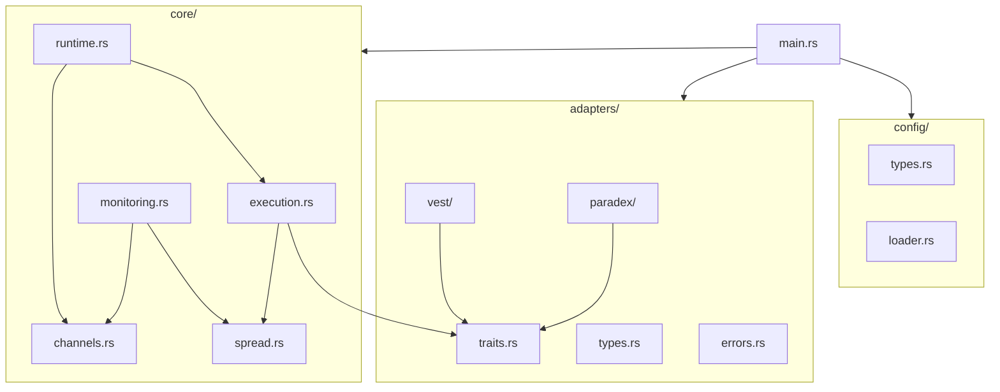

# HFT Arbitrage Bot - Source Tree

> **Updated:** 2026-02-04  
> **Scan Level:** Exhaustive (all source files read)

---

## Project Root

```
bot4/
├── Cargo.toml           # 75 lines - Dependencies manifest
├── Cargo.lock           # Lock file
├── config.yaml          # 341 bytes - Runtime config
├── README.md            # 1.5KB - Project intro
├── CONTRIBUTING.md      # 3KB - Contribution guide
├── .env                 # 2.3KB - Credentials (gitignored)
├── .env.example         # 3.3KB - Template
├── .gitignore           # 193 bytes
│
├── src/                 # 360KB total source
├── tests/               # Integration tests
├── docs/                # Generated documentation
├── _bmad/               # BMAD methodology files
└── _bmad-output/        # Sprint artifacts
```

---

## Source Directory (`src/`)

### Root Files

| File | Lines | Size | Purpose |
|------|-------|------|---------|
| `main.rs` | 242 | 9.6KB | Entry point, task spawning |
| `lib.rs` | 14 | 291B | Module exports |
| `error.rs` | 35 | 937B | AppError enum |

### Adapters (`src/adapters/`) - 230KB Total

```
adapters/
├── mod.rs              # 712B - Module exports
├── traits.rs           # 343 lines - ExchangeAdapter trait
├── types.rs            # 617 lines - Orderbook, Order types
├── errors.rs           # 3.3KB - ExchangeError enum
│
├── vest/               # 88KB - Vest Markets
│   ├── mod.rs          # 737B - Exports
│   ├── adapter.rs      # 56KB - Main adapter impl
│   ├── signing.rs      # 15KB - EIP-712 auth
│   ├── config.rs       # 5.3KB - VestConfig
│   └── types.rs        # 11KB - Vest-specific types
│
└── paradex/            # 106KB - Paradex
    ├── mod.rs          # 882B - Exports
    ├── adapter.rs      # 65KB - Main adapter impl
    ├── signing.rs      # 23KB - SNIP-12 auth
    ├── config.rs       # 5KB - ParadexConfig
    └── types.rs        # 12KB - Paradex types
```

### Core (`src/core/`) - 97KB Total

```
core/
├── mod.rs              # 1.5KB - Module exports
├── execution.rs        # 894 lines - DeltaNeutralExecutor
├── spread.rs           # 593 lines - SpreadCalculator
├── runtime.rs          # 398 lines - execution_task
├── monitoring.rs       # 308 lines - monitoring_task
└── channels.rs         # 5KB - SpreadOpportunity
```

### Config (`src/config/`) - 22KB Total

```
config/
├── mod.rs              # 584B - Exports
├── types.rs            # 499 lines - BotConfig, AppConfig
├── loader.rs           # 6.2KB - YAML loading
└── constants.rs        # 227B - Defaults
```

### Utilities (`src/bin/`)

```
bin/
├── monitor.rs          # Orderbook monitoring utility
└── test_paradex_order.rs # Order testing script
```

---

## Module Dependency Graph



---

## File Size Summary

| Module | Files | Total Size | % of Codebase |
|--------|-------|------------|---------------|
| adapters/vest | 5 | 88KB | 24% |
| adapters/paradex | 5 | 106KB | 29% |
| adapters/common | 4 | 36KB | 10% |
| core | 6 | 97KB | 27% |
| config | 4 | 22KB | 6% |
| root (main, lib, error) | 3 | 11KB | 3% |
| **Total** | **27** | **~360KB** | 100% |

---

## Test Files

### Unit Tests (inline in source)

Each module contains `#[cfg(test)]` blocks:
- `adapters/traits.rs` - MockAdapter tests
- `core/execution.rs` - DeltaNeutralExecutor tests
- `core/spread.rs` - SpreadCalculator tests
- `core/runtime.rs` - execution_task tests
- `core/monitoring.rs` - monitoring_task tests
- `config/types.rs` - Validation tests

### Integration Tests (`tests/`)

```
tests/
└── full_cycle.rs       # End-to-end trade cycle
```

---

## Critical Entry Points

| Entry Point | File | Function |
|-------------|------|----------|
| Application start | `main.rs` | `main()` |
| Monitoring loop | `monitoring.rs` | `monitoring_task()` |
| Execution loop | `runtime.rs` | `execution_task()` |
| Trade execution | `execution.rs` | `execute_delta_neutral()` |
| Position close | `execution.rs` | `close_position()` |

---

## Configuration Files

| File | Purpose | Format |
|------|---------|--------|
| `config.yaml` | Bot settings | YAML |
| `.env` | Credentials | ENV vars |
| `Cargo.toml` | Dependencies | TOML |
